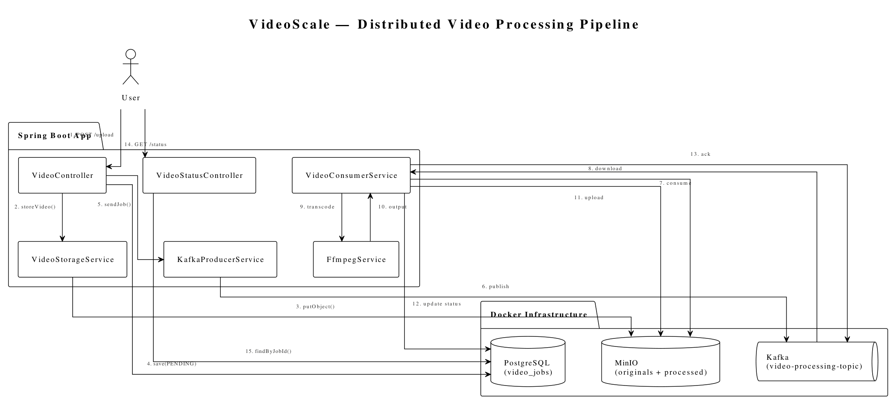
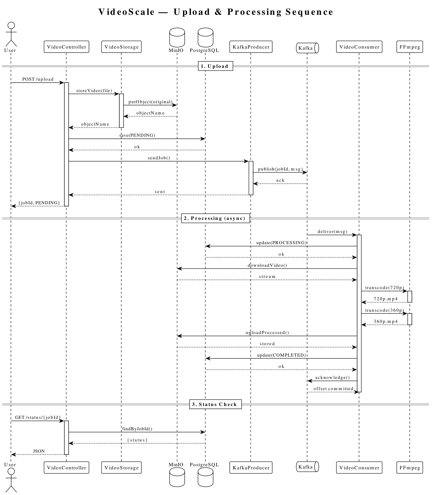

# VideoScale

Distributed video processing pipeline.

## What It Does
Upload a video → get back a job ID → worker transcodes it in the background → check status by job ID.

## Architecture
- **API (Spring Boot):** accepts uploads, publishes jobs to Kafka
- **Kafka:** asynchronous job queue
- **Worker (Spring Boot):** consumes jobs, runs FFmpeg
- **MinIO:** stores original + processed videos
- **PostgreSQL:** tracks job status
- **UI (Next.js):** upload videos, track jobs live

## Component Diagram




Spring Boot app (VideoController, VideoStatusController, VideoStorageService,
KafkaProducerService, VideoConsumerService, FfmpegService) against Docker
infrastructure — PostgreSQL (`video_jobs`), MinIO (originals + processed),
Kafka (`video-processing-topic`) — with the 15 numbered interactions from
`POST /upload` through transcode to `GET /status`.

## Tech Stack
- Java 17, Spring Boot 4
- Kafka 4.2 (KRaft mode)
- MinIO
- PostgreSQL 15
- FFmpeg
- Next.js 16 + Tailwind CSS 4
- Docker Compose

## How to Run
1. `docker compose up -d`
2. Wait ~30 seconds for Kafka
3. `mvn spring-boot:run` — backend on http://localhost:8080
4. `cd frontend && npm run dev` — UI on http://localhost:3000

## Prerequisites
- Java 17, Node 20+, Docker
- **FFmpeg on PATH** (with `libx264`) — the worker shells out to it; without it every job fails at PROCESSING. Verify: `ffmpeg -version`

## Configuration
Backend (`src/main/resources/application.properties`):

| Key | Default | Notes |
|---|---|---|
| `spring.servlet.multipart.max-file-size` / `max-request-size` | `50MB` | Raise for larger videos; requires backend restart |
| `spring.kafka.consumer.properties.max.poll.interval.ms` | `1800000` (30 min) | Must exceed slowest transcode, or the consumer is evicted mid-job and the message redelivers |
| `spring.kafka.consumer.properties.max.poll.records` | `1` | One video per poll |
| `minio.bucket-name` | `videos` | Auto-created on startup if missing |
| `spring.kafka.topic.video-processing` | `video-processing-topic` | Auto-created by the broker |

Frontend (`frontend/.env.local`, gitignored):
```properties
NEXT_PUBLIC_API_URL=http://localhost:8080
```
The UI calls the backend directly (the Next.js dev proxy truncates bodies over 10MB). CORS for `http://localhost:3000` is allowed in `CorsConfig.java`. Restart `npm run dev` after changing env.

## How It Works
1. User uploads video via POST /api/videos/upload (or the UI)
2. API saves to MinIO, creates job in PostgreSQL
3. API publishes job to Kafka topic
4. Worker consumes job, downloads from MinIO
5. Worker runs FFmpeg to transcode to 720p + 360p
6. Worker uploads results to MinIO
7. Worker updates job status to COMPLETED
8. User checks status via GET /api/videos/status/{jobId} (UI auto-polls)

## Request Flow

```text
┌──────────────┐
│    👤 User   │
└──────┬───────┘
       │ 1. POST /upload
       ▼
┌────────────────────────┐
│  🟢 VideoController    │
└────────┬───────────────┘
         ├──────────────────┐
         │                  │
         │ 2. Store         │ 3. Save job
         ▼                  ▼
┌─────────────────┐  ┌──────────────┐
│  📦 MinIO       │  │ 🗄️ PostgreSQL │
│  (original)     │  │ (status:     │
└─────────────────┘  │  PENDING)    │
                     └──────┬───────┘
                            │ 4. Publish job
                            ▼
                     ┌─────────────┐
                     │  📨 Kafka   │
                     │  topic      │
                     └──────┬──────┘
                            │ 5. Consume
                            ▼
                     ┌────────────────┐
                     │ 🟢 VideoConsumer│
                     │    Service     │
                     └───────┬────────┘
                             │ 6. FFmpeg
                             ▼
                     ┌──────────────┐   7. Upload processed
                     │  🎬 FFmpeg   │──────────────────► 📦 MinIO
                     └──────┬───────┘    (`processed/<jobId>/…`)
                            │ 8. Update status
                            ▼
                     ┌──────────────┐
                     │ 🗄️ PostgreSQL │
                     │ (COMPLETED)   │
                     └──────────────┘
```

## Sequence Diagram




Covers the three phases across VideoController, VideoStorage, MinIO, PostgreSQL,
KafkaProducer, Kafka, VideoConsumer, and FFmpeg: **1. Upload** (store → save
PENDING → publish → return jobId), **2. Processing** (consume → PROCESSING →
download → transcode 720p/360p → upload outputs → COMPLETED → ack), **3. Status
check** (lookup by jobId → JSON).

## What I Learned
- Kafka producer/consumer patterns
- Manual acknowledgment for at-least-once processing
- Consumer groups and partition assignment
- Async architecture with backpressure
- Distributed systems debugging
